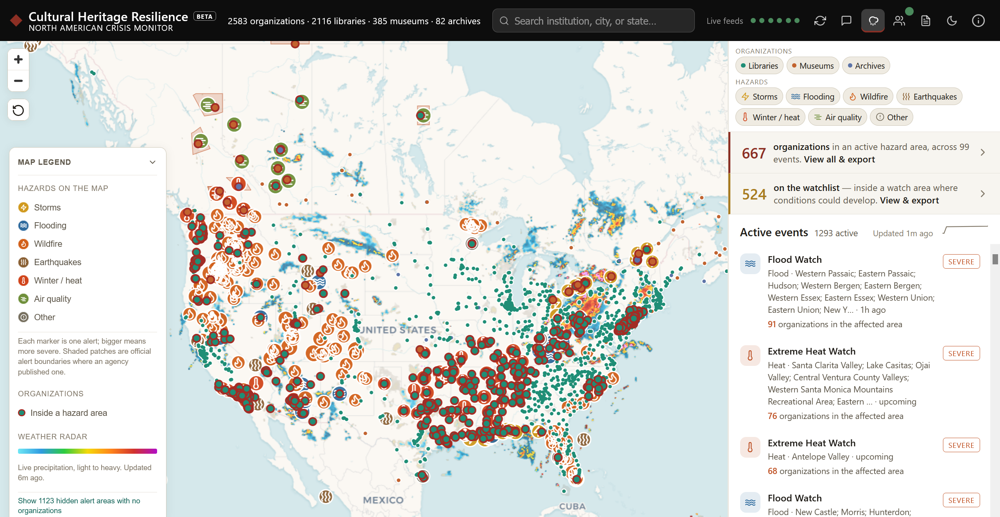

# Cultural Heritage Resilience

Prototype: This map shows a non-exhaustive sample of cultural heritage organizations
across North America and should not be treated as a complete directory.

This is an interactive live crisis map for North American cultural heritage organizations
showing hazards that threaten libraries, museums, and archives. A representative sample
of these organizations is plotted across North America alongside storms, floods,
wildfires, earthquakes, heat and cold, and air-quality alerts.



## What it does

- Displays 2,583 libraries, museums, and archives across the United States, Canada,
  and Mexico.
- Loads current weather alerts, earthquakes, wildfire incidents and satellite-derived perimeter estimates, and
  other natural events from public sources.
- Matches organizations to hazards by published boundary, official warned-zone outline, county approximation, or project-estimated radius.
- Lists affected organizations and ranks events that may require attention.
- Searches organizations by name, city, or state or province.
- Exports affected-organization lists as CSV files.
- Uploads a private CSV or TSV list of organizations to view on the map, with a
  "My list only" view that hides the public dataset.
- Provides an optional bring-your-own-key assistant for questions about the loaded map.

## Running it

The application is designed to be downloaded and run locally. It is a static site, so
there is no application installer, build step, server framework, or package installation.
You only need a modern web browser and Python 3.

1. Download the repository from GitHub and extract it, or clone it with Git.
2. Open a terminal or PowerShell window in the project folder.
3. Start the included local web server:

   ```bash
   python scripts/serve_local.py 8000
   ```

   On Windows, if `python` is not recognized but the Python launcher is installed, use
   `py scripts/serve_local.py 8000` instead.
4. Open <http://127.0.0.1:8000> in your browser.
5. When you are finished, return to the terminal and press **Ctrl+C** to stop the server.

**Windows alternative:** Instead of following steps 3-5 above, run
`Launch-Cultural-Heritage-Resilience.ps1` from the project folder. It starts one
foreground Python process, binds a new restricted loopback server, and opens only the
port that process owns. Keep its terminal window open while using the map, then press
**Ctrl+C** to stop it. The launcher never probes or reuses an existing local web server.

Opening `index.html` directly is not supported. Use one of the local server options above.

## Phone and tablet use

The same application adapts to phone, tablet, and desktop browsers. On phones, filters
start collapsed and the list-size control can give more space to events or details.
See [mobile support and known limitations](MOBILE-READINESS.md) for tested layouts and
the remaining physical-device and accessibility checks.

## Data shown on the map

**Organizations:** The map includes a curated 583-place demonstration set plus samples
of 1,000 US public libraries from IMLS and 1,000 US academic libraries from NCES IPEDS.
Green points mark libraries, orange points mark museums, and blue points mark archives.
A red ring marks an organization within an active hazard area. Select a point to view
its profile, website, and current hazards.

**Hazards:** Public feeds are refreshed approximately every five minutes.

| Feed | Coverage | Selection used by this project |
|------|----------|--------------------------------|
| [NWS alerts](https://www.weather.gov/documentation/services-web-api) | United States | Actual watches, warnings, and advisories rated Moderate, Severe, or Extreme; selected test, marine, surf, beach, rip-current, lakeshore, and low-water alerts are excluded |
| [Environment Canada](https://api.weather.gc.ca) | Canada | Active watches and warnings plus orange- or red-risk alerts; ended and cancelled alerts are excluded |
| [USGS](https://earthquake.usgs.gov/earthquakes/feed/v1.0/geojson.php) | North America | Earthquakes of magnitude 3.0 or greater from the weekly feed |
| [NIFC WFIGS](https://data-nifc.opendata.arcgis.com) | United States | Active wildfire incidents of at least 100 acres |
| [CWFIS](https://cwfis.cfs.nrcan.gc.ca) | Canada | Satellite-derived FireM3 perimeter estimates larger than 500 hectares; these are not operational incident perimeters |
| [NASA EONET](https://eonet.gsfc.nasa.gov) | North America | Selected open wildfires, severe storms, volcanoes, and floods, with overlapping US and Canadian events excluded |

RainViewer supplies the optional precipitation-radar overlay; a radar frame more than 30
minutes old is labeled stale. When a hazard source temporarily fails, the interface marks
it stale and retains its last successful response for up to one hour. Expired alerts are
removed from retained responses. The 24-hour impact trend records complete refreshes for
the public demonstration dataset only, so private lists and view filters do not change its
scope.

Toggle hazard layers and organization types with the filter chips. Select an event for its
detail: affected-organization list (each row jumps to that institution), full official
text, severity, timing, and a link to the authoritative source or news report.

These thresholds reduce noise but limit coverage. An event or organization that is not
shown may still require attention. See [Data sources and methodology](DATA_SOURCES.md) for
the complete selection rules, project screening-priority thresholds, and match methods.

## How impact matching works

Each organization is checked against each event using the most precise available method:

1. **Published polygon:** organizations are matched by point-in-polygon when a source
   publishes a usable event boundary.
2. **Official warned zone:** for NWS alerts without a polygon, the app fetches the alert's
   official warned-zone outlines and re-matches organizations by point-in-polygon. These
   requests are scheduled only by matches in the public demonstration dataset, so a
   private-only match cannot change outbound traffic.
3. **County approximation:** while an NWS warned-zone outline is unavailable, county-coded
   alerts use an explicitly labeled county-level approximation.
4. **Estimated radius:** point events such as earthquakes, wildfire incidents, and EONET
   events use a project-estimated screening radius. It is not an official impact,
   evacuation, or damage boundary.

The application preserves provider severity when it is available and uses a separate
**Project screening priority** to compare events from different sources. The project label
is a screening aid, not an official provider rating.

Events affecting mapped organizations appear first. Severity and the number of affected
organizations determine the order within that group.

## Using the results

The information panel provides three ways to work with affected organizations:

- **Impact summary:** shows the number of organizations inside active hazard areas.
- **Affected-organization list:** groups organizations by state or province and links each
  record to its map location.
- **CSV export:** includes organization names, types, locations, websites, and associated
  hazards for outreach or internal planning.

An organization can upload a list of organizations to view on the map. The file remains
in that browser's local storage. Imports are limited to 5 MB and 10,000 rows. An
active-list indicator remains visible until the user chooses **Remove my list**. Once a
list is active, a **My list only** filter chip can hide the public dataset entirely, so
the map, impact counts, affected views, situation briefs, and exports reflect just the
uploaded organizations. The setting persists in that browser and turns itself off if the
list is removed. See [PRIVACY.md](PRIVACY.md) for details.

## Assistant (experimental, optional, bring-your-own-key)

A collapsible assistant panel answers questions about the organizations and events loaded
on the map. Open the panel, choose a provider and model, and enter an API key. It supports
Anthropic Claude and OpenAI-compatible endpoints.

How it stays safe:

- **API keys:** A key stays in page memory only for the selected provider and endpoint. It
  is cleared when that recipient changes and when the page reloads or closes. Use a
  restricted, spend-limited key.
- **Private overlays:** Assistant access to an uploaded list requires explicit permission
  for each selected provider and endpoint in the current page session.
- **Available actions:** Assistant tools search loaded data, change filters, focus the map,
  and open affected-organization views.
- **Public feed text:** Event descriptions are handled as untrusted data.
- **Request limits:** User messages are limited to 4,000 characters, old context is
  compacted, request and response sizes are capped, and a provider call times out after
  45 seconds. Replies are capped at 1,024 output tokens. Creating a situation brief through
  the assistant requires confirmation.

## Technical notes

- The application uses HTML, CSS, and JavaScript without a build system.
- MapLibre GL JS 4.7.1 is included in `vendor/maplibre-gl/`.
- OpenFreeMap provides the OpenStreetMap-derived basemap, including state and province
  labels, without requiring an API key.
- Organization points are displayed individually.
- The interface supports light and dark themes.
- The information panel lists the live and organization-data sources.

## Project structure

```
index.html            markup, dialogs, script/style includes
styles.css            all styling, light + dark themes
data/organizations.js curated org dataset (name, type, location, website, county FIPS)
data/libraries-expanded.js 2,000 permanent public and academic library records
docs/images/          screenshots used in repository documentation
js/feeds.js           live hazard feed fetchers + normalizers (one place to add a feed)
js/app.js             map, impact matching, panel, popups, search, filters, theme; exposes window.HW
js/security.js        shared URL, CSV, and assistant privacy guards
js/chat.js            optional assistant panel: BYO-key LLM + tool-calling over window.HW
tests/                dependency-free Node tests plus local-server Python tests
vendor/maplibre-gl/   pinned MapLibre GL JS runtime, license, and integrity manifest
scripts/serve_local.py restricted loopback-only development server
scripts/launch_local.py owns the local server socket and opens its exact browser URL
Launch-Cultural-Heritage-Resilience.ps1 minimal Windows wrapper for the Python launcher
scripts/              data conversion, validation, and county-FIPS build tools
```

`scripts/enrich_library_websites.mjs` is the reproducible enrichment step for public-
library URLs. IMLS does not publish a website field in its FY2023 public-use files, so the
script accepts only strong name-and-location matches from OpenStreetMap and records their
provenance; ambiguous matches remain empty. `scripts/apply_official_websites.mjs`
reapplies the separate 401-record official-site search review stored in
`data/official-library-websites.json`.

Run the automated checks with Node.js 22 or later:

```bash
node --test "tests/*.test.cjs"
node --check js/security.js
node --check js/feeds.js
node --check js/app.js
node --check js/chat.js
python -B -m unittest tests/test_serve_local.py tests/test_launch_local.py
node scripts/check_vendor_integrity.mjs
node scripts/check_sensitive_files.mjs
```

## Possible future directions

This prototype could be extended to support additional preparedness, response, and
recovery needs. Possible future development includes:

- Adding overlays for geographically based emergency networks, showing their service
  areas and which cultural heritage organizations fall within them.
- Providing links to trusted emergency-planning and preparedness resources.
- Providing links to recovery resources, including suppliers, service providers, and
  emergency contacts. Listings would need regular review and should not be treated as
  endorsements.
- Creating versions tailored to individual states, provinces, territories, or other
  regions.
- Working with associations, consortia, government agencies, and other organizations to
  adapt the application for the institutions and networks they support.
- Continuing [mobile and tablet usability testing](MOBILE-READINESS.md) across real devices and assistive technologies.

## Development and attribution

Created and maintained by [FreshPremise](https://github.com/FreshPremise).

FreshPremise used OpenAI Codex and Anthropic Claude Code for assistance with coding,
review, testing, and documentation. Project direction, decisions, and final review are
by FreshPremise.

---

*For situational awareness. Always follow official guidance from local authorities.
Basemap: OpenFreeMap © OpenMapTiles, data from OpenStreetMap.*
